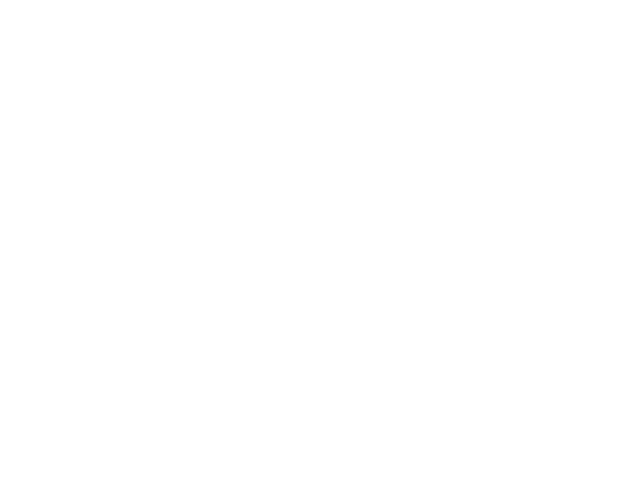

# Obstacle avoidance using A*

## Project subject
The aim of the project was to design an obstacle avoidance system based on the A* algorithm. The work can be divided into three main tasks. The first task is to perceive the environment in order to detect obstacles that the car is approaching. The second task is to generate input for the A* algorithm. The third task is to use the planning algorithm to generate a path that goes around the detected obstacles. To fulfill these tasks, we developed two packages and included them in the f1tenth_launch repository.

## Block diagram

## Env_Perceiver package
The first package we created for this project is env_perceiver. This package has two functions:

 1. The first function is to detect obstacles in front of the car and publish an alarm to the /obstacle_alarm topic. This is achieved by grouping LiDAR scan points into clusters using the DBSCAN algorithm. Then, the center of each cluster is calculated, and if it is within the car's field of view, it is classified as an obstacle. The next step involves checking the referential trajectory. If a cluster classified as an obstacle crosses it, an obstacle alarm is generated.

2. The second function is to create input for the A* algorithm. To run A*, we need an occupancy grid of the surrounding area, start and goal points. The package generates a local occupancy grid that rotates with the car by updating the global occupancy grid using LiDAR scans and the car's odometry. It then fills the free cells of the occupancy grid with a cost based on their distance from the wall. The goal of this operation is to delineate the rough centerline of the available area. To find the goal point for A*, the created occupancy grid is sliced in half, and the goal point is chosen as the cell with the minimum value in the more distant half of the local occupancy grid. The start point is the current position of the car. These inputs for A* are published to the /local_occupancy_grid, /goal_point, and /start_point topics.

### Subscribed topic
    /localization/kinematic_state: nav_msgs/msg/Odometry
    /map: nav_msgs/msg/OccupancyGrid
    /planning/racing_planner/trajectory: autoware_auto_planning_msgs/msg/Trajectory
    /sensing/lidar/scan: sensor_msgs/msg/LaserScan

### Published topic
    /border_pointcloud: sensor_msgs/msg/PointCloud2 (Debug)
    /goal_point: geometry_msgs/msg/Pose
    /goal_pointcloud: sensor_msgs/msg/PointCloud2 (Debug)
    /local_occupancy_grid: nav_msgs/msg/OccupancyGrid
    /obstacle_alarm: std_msgs/msg/String
    /start_point: geometry_msgs/msg/Pose
    /start_pointcloud: sensor_msgs/msg/PointCloud2 (Debug)

## Traj_Selector package
The second package we created is traj_selector. It runs the A* algorithm using the inputs generated by env_perceiver. Based on the /obstacle_alarm topic, it publishes the selected trajectory to the /planning/racing_planner/avoidance/trajectory topic. If an alarm occurs, it runs the A* algorithm and publishes its results for a specified "out_time" period. If no alarm occurs, it publishes the referential trajectory unchanged.
### Subscribed topic
    /goal_point: geometry_msgs/msg/Pose
    /local_occupancy_grid: nav_msgs/msg/OccupancyGrid
    /localization/kinematic_state: nav_msgs/msg/Odometry
    /obstacle_alarm: std_msgs/msg/String
    /planning/racing_planner/trajectory: autoware_auto_planning_msgs/msg/Trajectory
    /start_point: geometry_msgs/msg/Pose

### Published topic
    /planning/racing_planner/avoidance/trajectory: autoware_auto_planning_msgs/msg/Trajectory
    /waypoint_pointcloud: sensor_msgs/msg/PointCloud2 (Debug)

## System presentation

[Youtube](https://youtu.be/4mSixAMh0oY)