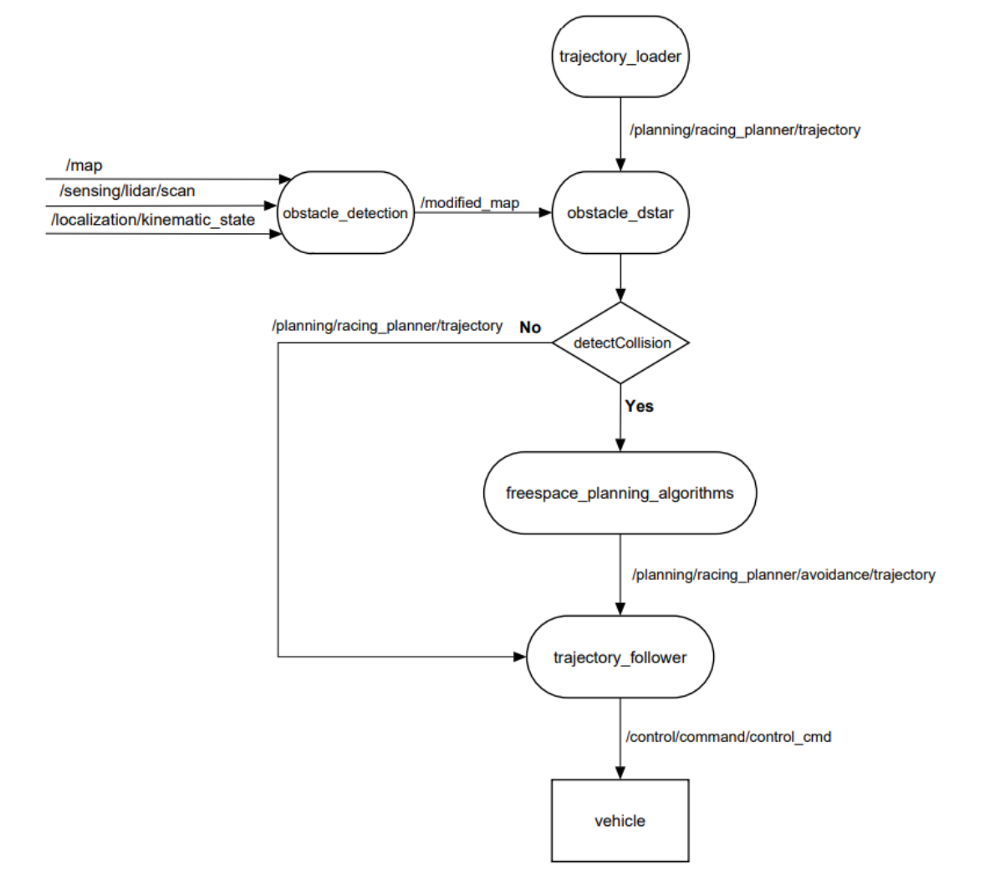
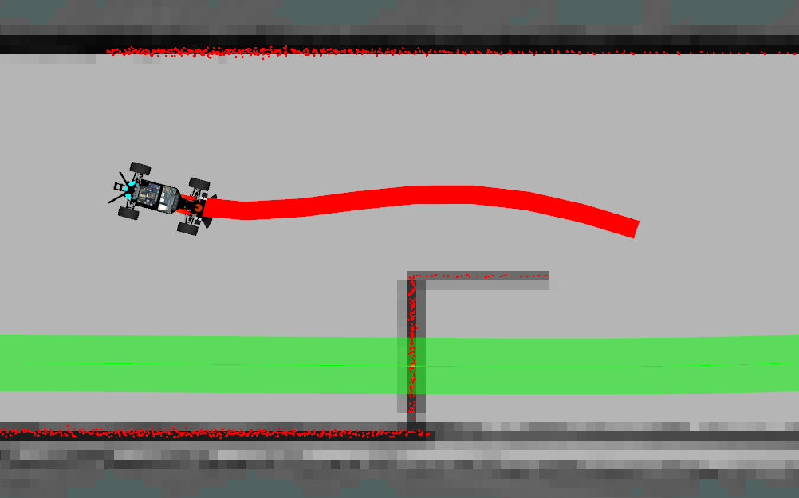
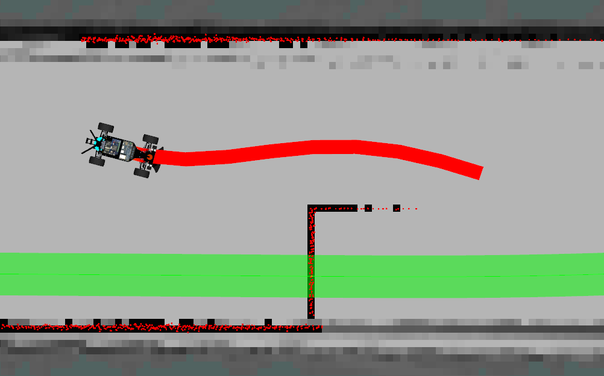
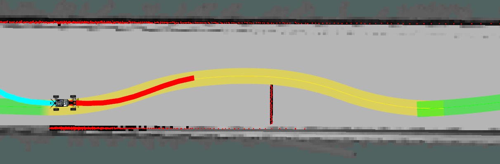
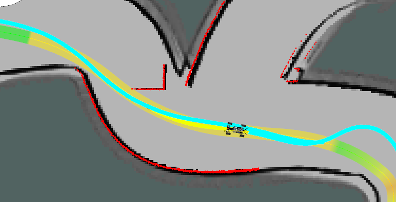
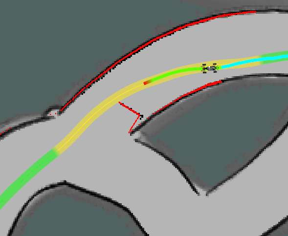
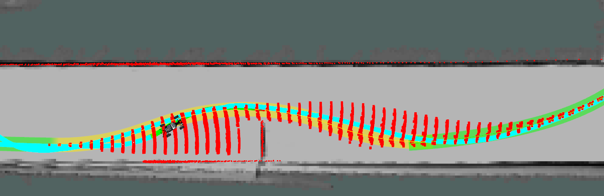

# Obstacle avoidance planning using graph-based algorithms

The goal of this project is to allow F1TENTH autonomous car to avoid obstacles that are present on the track. The environment is designed so that the car follows a predefined trajectory (`/planning/racing_planner/trajectory`), which is partially modified when computing obstacle avoidance.

Obstacles are detected using data from laser scanner and added to the occupancy map. The selected A* or D* planner finds avoidance trajectory in the free space beetwen start node and the goal node. Modified trajectory consists of waypoints with the least cost to reach based on heuristics. For real-time operation a partial grid map is extracted to tighten searching space. The goal node is a parameter and is set to be +30 nodes in the original trajectory from the current node when an obstacle is detected.


## Installation

Requirements for this project is a valid instalation of Autoware environment, you can check it under this link [Installation](../../../installation/index.md). 

You can run demo project with

```bash
ros2 launch f1tenth_launch e2e_simulator.launch.py
```

After that you can launch AWSIM with

```bash
./autoware_awsim/AWSIM_v1.2.0.x86_64
```
To start autonomous driving u need to have a pad. On the Xbox pad you should press
```bash
 X -> A -> B -> left arrow -> B
```

If you don't have a pad u can try to use this command to change gear to DRIVE 

```bash
ros2 topic pub /control/command/gear_cmd autoware_auto_vehicle_msgs/msg/GearCommand {"command: 2"}
```

You can see results of trajectory planning using A* below.

<video src="videos/obstacle_astar.mp4" type="video/mp4" width="1000" controls>
    Your browser does not support the video tag.
</video>

## Block diagram

A block diagram below shows all used topics and packages included in this project. 
<p align="center">
  
</p>

Inside the `freespace_planning_algorithms` package there are multiple algorithms that can be used for path planning. The name of the algorithm to use can be specified in e.g.  `obstacle_dstar.param.yaml`. In case of D* you should use package `obstacle_dstar` and for A* you should use `obstacle_astar` package.

It is crucial because of differences inside `onTimer` function which is the main loop of the algorithm.

## Packages API

The package can be found in src folder.

### obstacle_detection

| Topic                           | Type                         | Function                        | Description                                                   |
|---------------------------------|------------------------------|---------------------------------|---------------------------------------------------------------|
| `/sensing/lidar/scan`           | sensor_msgs::msg::LaserScan  | Input scans from LIDAR          | Scans used to detect obstacles and add them to the occupancy grid |
| `/map`                          | nav_msgs::msg::OccupancyGrid | Input original map              | Generated map from `cartographer`                               |
| `/localization/kinematic_state` | nav_msgs::msg::Odometry      | Input odometry for localization | Original odometry                                             |
| `/modified_map`                 | nav_msgs::msg::OccupancyGrid | Output map with obstacles       | Occupancy grid map with obstacles detected by LiDAR.          |

### obstacle_astar

| Topic                                           | Type                                         | Function                        | Description                                                                                   |
|-------------------------------------------------|----------------------------------------------|---------------------------------|-----------------------------------------------------------------------------------------------|
| `/planning/racing_planner/trajectory`             | autoware_auto_planning_msgs::msg::Trajectory | Input reference trajectory      | Trajectory that is originally subscribed                                                      |
| `/modified_map`                                 | nav_msgs::msg::OccupancyGrid                 | Input map with obstacles        | Occupancy grid map with obstacles detected by LIDAR. It is made by obstacle_detection package |
| `/localization/kinematic_state`                 | nav_msgs::msg::Odometry                      | Input odometry for localization | Original odometry                                                                             |
| `/planning/racing_planner/avoidance/trajectory` | autoware_auto_planning_msgs::msg::Trajectory | Output modified trajectory      | Modified trajectory output by planner     

### obstacle_dstar

| Topic                                           | Type                                         | Function                        | Description                                                                                   |
|-------------------------------------------------|----------------------------------------------|---------------------------------|-----------------------------------------------------------------------------------------------|
| `/planning/racing_planner/trajectory`             | autoware_auto_planning_msgs::msg::Trajectory | Input reference trajectory      | Trajectory that is originally subscribed                                                      |
| `/modified_map`                                 | nav_msgs::msg::OccupancyGrid                 | Input map with obstacles        | Occupancy grid map with obstacles detected by LIDAR. It is made by obstacle_detection package |
| `/localization/kinematic_state`                 | nav_msgs::msg::Odometry                      | Input odometry for localization | Original odometry                                                                             |
| `/planning/racing_planner/avoidance/trajectory` | autoware_auto_planning_msgs::msg::Trajectory | Output modified trajectory      | Modified trajectory output by planner                                                         |                                     |

## Main components description

### Detecting obstacles
One of the main functionalities is obstacle detection. It is done by `obstacle_detection` package. Based on the input LiDAR scans, odometry and occupancy grid from cartographer it detects map indices where the laser hit an obstacle. If at least `cell_count_th` scans lies in a certain grid cell, it is set as occupied. Modified map is then published to `/modified_map` topic and can be used by planning algorithms to find avoidance trajectory.

| Original map | Modified map |
| ------------ | ------------ |
|  |  |


### New trajectory planning - A*
`obstacle_astar` package is partially based on autoware.universe `freespace_planner` package. It periodically does the following steps:
- from the current trajectory it cuts out a partial trajectory of a certain length from the current pose onwards,
- checks whether there is an obstacle on this partial trajectory in function `isPlanRequired`,
- when obstacle is found it extracts partial grid map from original one and sets map for planner,
- performs planning using specified algorithm,
- creates a new trajectory by removing nodes from original one and replacing it with new avoidance trajectory from planner,
- sets current trajectory as the one that the car is currently following,
- drives around an obstacle until the car is near goal node,
- when reaching goal node it switches to referential trajectory,
This loop ensures that if the car move closer to the obstacle and its shape or position changes, the trajectory can be replanned over and over again. 


<p align="center">
  
</p>

<p align="center">
  
</p>

<p align="center">
  
</p>


To help the proces of implementation the algorithm there have beed added markers to the project. Each marker is placed in the position of every node regarding it orienatation. All markers are stored in `MarkerArray`. To view them you need to add `/markers` topic in the rviz. One of the possible outcome might look like this
 
<p align="center">
  
</p>

### New trajectory planning - D*Lite


## Future work

