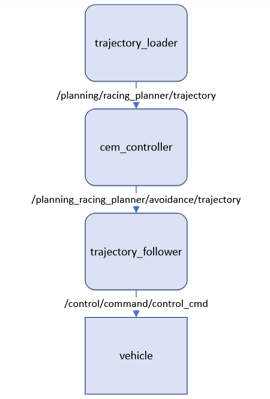
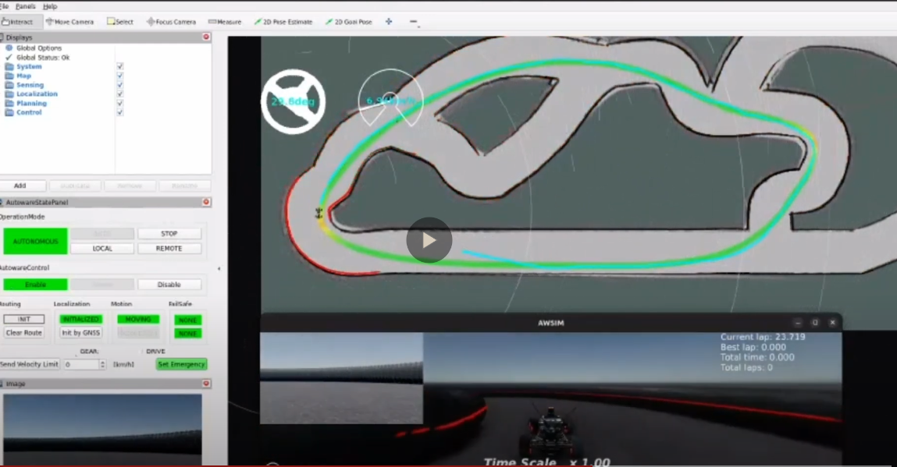
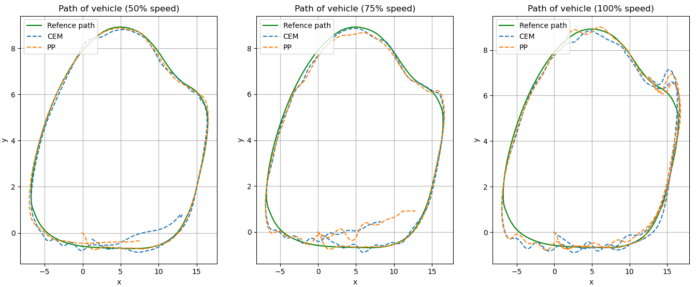
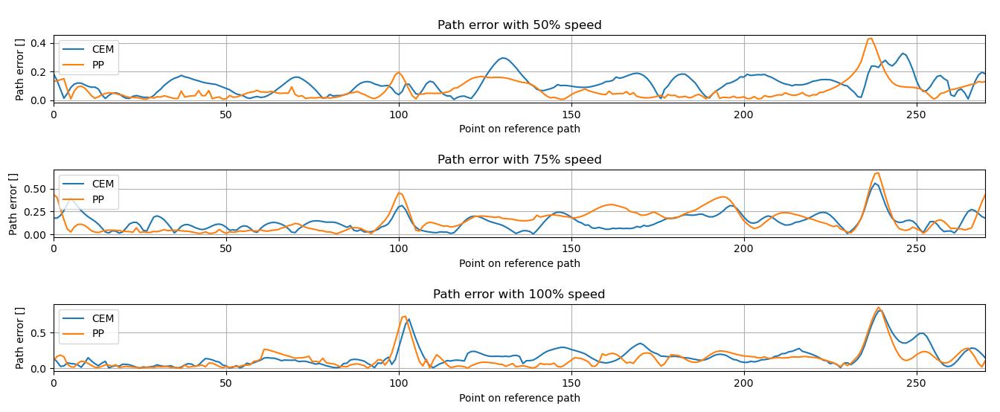

# Cross-Entropy Method controller

## About Cross-Entropy Method
&emsp;The cross-entropy method is a Monte Carlo method for importance sampling and optimization. It is applicable to both combinatorial and continuous problems, with either a static or noisy objective.
&emsp;The CEM algorithm is an optimization method based on minimizing the cost function f(x) by searching for a suitable x. In this project, the minimum Cartesian distance between the destination point and each ozone in the model-calculated vehicle trajectory.
&emsp;The route the vehicle will take is calculated from its model, the input of which is given a matrix of dimension Nx2. Columns of the matrix as acceleration and steering angle, N as a predefined length of the steering sequence. Simulation of the trajectory is interrupted when the cost at the point under consideration reaches a value less than a predefined threshold. This is to reduce the computation time for the best controls, which would start to move away from the target point with further path calculation. The normal distribution is updated so that the new mean value µ equals the mean value from the set of elites, i.e. the fixed number of controls with the lowest cost, and the standard deviation decreases by a fixed percentage. 

&emsp; The pseudo-code describing the operation of the CEM controller is shown below.

```
Parameters:
L - minimum target distance, 
CEM_iterations - number of iterations of the CEM loop,
µ - mean value of Gaussian distribution, 
σ - standard deviation.

for t = 0 to T - 1 to
	target point ← point on the trajectory distant by L
	acceleration ← proportional controller (vzad - v)
	for i = 0 to CEM_iterations -1 to
		torsion angles ← a set of M controls with N (µ, σ)
		costs ← calculation of least cost
		elites ← set K of controls with least cost
	end for
	µ, σ ← update the normal distribution
	execution of action with µ
end for
```
## About implementation
&emsp; The implemented controller was used to solve the 1-dimensional problem of finding the optimal steering angle. In the future, the project can be developed in such a way that the algorithms will simultaneously calculate also the optimal acceleration extending the control problem to the second dimension.

&emsp; Using the C++ programming language, functions used in the controller logic were implemented:
- cemSteerControl - the function calls the calcIsSteerConverged and getAction functions in a loop, the output of the function gives the value of the coulomb twist,
- calc_distance - function calculates the Cartesian distance between points on the trajectory and the vehicle,
- yawFromPose - calculation of Yaw orientation from Pose message,
- getAction - function on the basis of drawn elites selects the final control, sigma and mu parameters responsible for the interval from which the controls will be drawn are changed
- discreteDynamics - function calculates, based on the model and forcing, the states of the object at the next moment after time dt,
 - simulateCost - the function calculates the cost (Cartesian distance) between the target point and the point where the vehicle will be after the given control,
- randomSteer - draws a control from a normal distribution.

A block diagram shows the structure of the F1tenth vehicle control program with the implemented ROS node responsible for the CEM steering controller.




### Obtained results
&emsp; The final version of the controller allowed to perform a full lap, but the jerky nature of  he steering caused by the nature of the controller prevents stable repetition of laps. Reducing the speed to 75% of the maximum speed allowed for stable laps. The dynamic change in the position of the wheels led to problems with the stability of the cartographer's pack, which directly led to problems with locating the vehicle on the map, resulting in collisions with the wall.


[](https://youtu.be/zLHvjh3hEIg)

## Launching package
Before launching, it is necessary to download packages via the `f1tenth_awsim_04.repos` file, which contains the mentioned controller. This should be done with the command:
`vcs import src < f1tenth_awsim_04.repos`
And then build the downloaded package:
`` vcs pull src rosdep update rosdep install -y --from-paths src --ignore-src``
`colcon build --symlink-install --cmake-args -DCMAKE_BUILD_TYPE=Release \ -DCMAKE_EXPORT_COMPILE_COMMANDS=On`
Once completed, the startup proceeds in the standard manner, In one terminal window:
`source ~/autoware/intall/setup.bash ./autoware_awsim/AWSIM_v1.2.0_F1TENTH/AWSIM_v1.2.0.x86_64`
In the next window:
`source ~/autoware/intall/setup.bash
 ros2 launch f1tenth_launch e2e_simulator.launch.py`
Put your vehicle in autonomous driving mode. Press the B button on the pad, then X to activate remote control. Successively change gear using the directional pad (D-pad) by pressing “left”. To activate autonomous driving mode, after changing gear, press the B button.

## Tests and comparison with pure pursuit 
### Node used to measure differences between controllers
A node subscribing to the topic `/awsim/ground_truth/vehicle/pose` was created to compare controllers based on the distance from the nearest point of the reference path. The subscribed position values were saved to a `.csv` file to calculate the nearest point from the reference trajectory list.
### Results



<obrazy>
## Conclusions

- The characteristics of the CEM controller means that operation at higher speeds negatively affects the stability of other systems - notably catrographer node,
-  Fast turning tilts the vehicle which interferes with the laser scanner,
- results are comparable to the pure pursuit controller.
