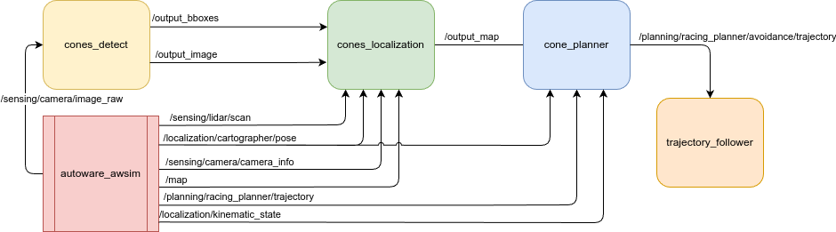

# Cones' avoidance by slalom

## Problem overview
The aim of the project was to design a cones' avoidance system for the F1TENTH car using autoware.
The system decides from which side the cone should be avoided based on its color (blue from the right side and yellow from the left).
The shape and the colors of the cones have been taken from Formula Student competition.
The project uses a modified version of the f1tenth map with cones added onto the track.

The main parts of the project are:

- **perception** - detecting the cones and their colors,
- **data fusion** - sensor fusion using data from camera and lidar to get the cones' positions,
- **planning** - planning the local path to avoid the cones.

This task needs simulation environment, such can be found at: [google drive](https://drive.google.com/file/d/120lfWwmwZQP8B92OaJJC9ZP7CW3OX9RW/view?usp=sharing)

## System schematic

## Perception
Node `cones_detection` is designed to detect cones with respect to Formula Student regulations. This task has implemented YOLOv8 algorithm and NVidia TensorRT optimalization platform for acceleration purposes, utilizing GPU.

Subscribed topic `/sensing/camera/image_raw` is only vision information.

Node publishes topics:
- `output_boxes` - position and color of detected cones in custom message format `Cones` which is a list of objects type `BoundingBox` 
- `output_image` - optional (`show_image` parameter (Boolean)) - camera output with added Bounding Boxes

Custom message types BoundingBox and Cones are located in `cones_interfaces` package, their representations are as follow:

| Name        | .msg content                                                               |
| ----------- | -------------------------------------------------------------------------- |
| BoundingBox | std_msgs/Header header   BoundingBox[] bboxes                           |
| Cones       | float32 x1   float32 y1   float32 x2   float32 y2   char label |

This package is supplied with trained model in .onnx format, when node is executed for the first time, TensorRT .engine file is forced to generate, since it is hardware specific, then it continues inference in loop

Package repository is available [here](https://github.com/BartlomiejGasyna/cones_detect).

## Data fusion

For data fusion the `cone_localization` node is used.
It utilizes data from the camera, lidar, the car's current position, and cones detection information within the image.

The node employs topic synchronization using the message_filters package.
In this application, the package uses approximate_synchronizer.
It operates by caching messages from various topics and matching them based on timestamps.

Lidar data is integrated with camera images. Based on the bounding box information received, a decision is made regarding which lidar measurements are included in the received labels.
Using the car's current position and the set of lidar measurements assigned to each cone, the global position of each obstacle on the track is determined.

A Kalman filter is employed to improve obstacle mapping and mitigate the impact of overstated measurements.

A buffer storing cones was utilized.
This allows the position of a detected obstacle to be updated on the map with its newly detected position whenever it is detected again.

### Subscribed Topics
| Name                              | Type                            | Description                         |
| --------------------------------- | ------------------------------- | ----------------------------------- |
| `/output_bboxes`                  | cones_interfaces::msg::Cones    | Cones bouinding boxes               |
| `/output_image`                   | sensor_msgs::msg::Image         | Image with labeled cones            |
| `/sensing/lidar/scan`             | sensor_msgs::msg::LaserScan     | Lidar scan                          |
| `/localization/cartographer/pose` | geometry_msgs::msg::PoseStamped | Pose of the vehicle                 |
| `/sensing/camera/camera_info`     | sensor_msgs::msg::CameraInfo    | Information about camera parameters |
| `/map`                            | nav_msgs::msg::OccupancyGrid    | Occupancygrid map                   |

### Published Topics
| Name          | Type                         | Description                               |
| ------------- | ---------------------------- | ----------------------------------------- |
| `/output_map` | nav_msgs::msg::OccupancyGrid | Occupancy grid map with virtual obstacles |

### Parameters
| Name                         | Type  | Description                                                                                               |
| ---------------------------- | ----- | --------------------------------------------------------------------------------------------------------- |
| `cones_number_map`           | int   | The number of cones that will be taken into account when determining the obstacles                        |
| `cones_shift_factor`         | float | Angular displacement of lidar data                                                                        |
| `cones_distance_measurement` | float | The distance of the car from the bollard at which the position of the bollard will be recorded on the map |
| `kalman_on`                  | bool  | The value that determines whether kalman filtration will be carried out                                   |
| `kalman_meas_variance`       | float | Magnitude of the measurement variance                                                                     |

## Planner
To plan a trajectory around the cones, the `cone_planner` node is used.
This node uses the *Informed RRT\** algorithm implemented in `freespace_planning_algorithms` package.

The planner node runs an `onTimer` callback at rate specified by the `update_rate` parameter.
This callback checks if the replanning is needed and if it is, it runs the RRT planner.
Conitions on which the replanning is performed area:

- there is no planned trajectory,
- the vehicle is near the goal position,
- new obstacle was found and it intersects the planned trajectory,
- distance between vehicle and trajectory is larger than threshold specified by the `th_course_out_distance_m` parameter.

When theres is no planned trajectory or the planner is during replanning, the vehicle is stopped.

### Subscribed Topics
| Name                                  | Type                                         | Description                                          |
| ------------------------------------- | -------------------------------------------- | ---------------------------------------------------- |
| `/planning/racing_planner/trajectory` | autoware_auto_planning_msgs::msg::Trajectory | Reference trajectory                                 |
| `/output_map`                         | nav_msgs::msg::OccupancyGrid                 | Occupancy grid map with virtual obstacles            |
| `/localization/cartographer/pose`     | geometry_msgs::msg::PoseStamped              | Pose of the vehicle                                  |
| `/localization/kinematic_state`       | nav_msgs::msg::Odometry                      | Odometry used for checking if the car stopped or not |

### Published Topics
| Name                                            | Type                                         | Description        |
| ----------------------------------------------- | -------------------------------------------- | ------------------ |
| `/planning/racing_planner/avoidance/trajectory` | autoware_auto_planning_msgs::msg::Trajectory | Planned trajectory |

### Parameters
| Name                         | Type  | Description                                                                                                                          |
| ---------------------------- | ----- | ------------------------------------------------------------------------------------------------------------------------------------ |
| `update_rate`                | float | Update rate of checking if replanning is needed                                                                                      |
| `waypoints_velocity`         | float | Reference velocity at planned trajectory points                                                                                      |
| `vehicle_shape_margin_m`     | float | Car perimeter margin used for planning                                                                                               |
| `th_arrived_distance_m`      | float | Distance between car and goal point to consider that the goal pose has been achieved                                                 |
| `th_stopped_time_sec`        | float | Time after stopping to consider that the car stopped successfully                                                                    |
| `th_stopped_velocity_mps`    | float | Velocity threshold to consider that the car stopped                                                                                  |
| `th_course_out_distance_m`   | float | Distance between car and planned trajectory above which replanning is triggered                                                      |
| `lookahead_distance`         | int   | Number of points on reference trajectory to offset the goal pose from the current one                                                |
| `c_space_margin_m`           | float | C space margin. When it equals 0 the C space is a rectangle spanned over the current pose and the goal pose                          |
| `replan_when_obstacle_found` | bool  | True if replanning should be triggered when the new obstacle is found                                                                |
| `replan_when_course_out`     | bool  | True if replanning should be triggered when the vehicle is out of the planned trajectory                                             |
| `time_limit`                 | float | Max time until finding path                                                                                                          |
| `minimum_turning_radius`     | float | Min car turning radius                                                                                                               |
| `theta_size`                 | int   | Discretization resolution of the heading angle range                                                                                 |
| `obstacle_threshold`         | int   | Cost value threshold to be considered an obstacle                                                                                    |
| `rrt_enable_update`          | bool  | True if planning should be continued after finding the valid path                                                                    |
| `rrt_max_planning_time`      | float | If the planning time was smaller than this value the planner performs path length optimization until specified amount of time passes |
| `rrt_margin`                 | float | Additional car perimeter margin used by RRT planner itself                                                                           |
| `rrt_neighbor_radius`        | float | Radius in which checking if shorter path exist through other neighbor is performed                                                   |

## Demo of the working system
Demo of the working system: [YouTube](https://youtu.be/g8tYqr2Q0ec)
