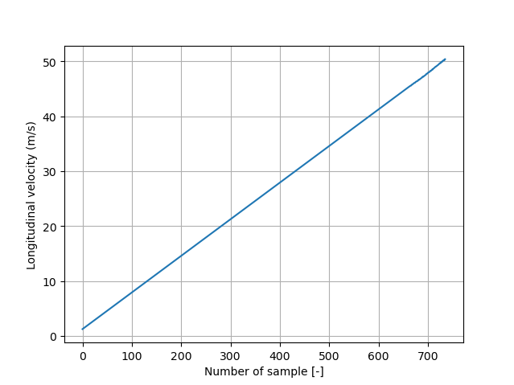
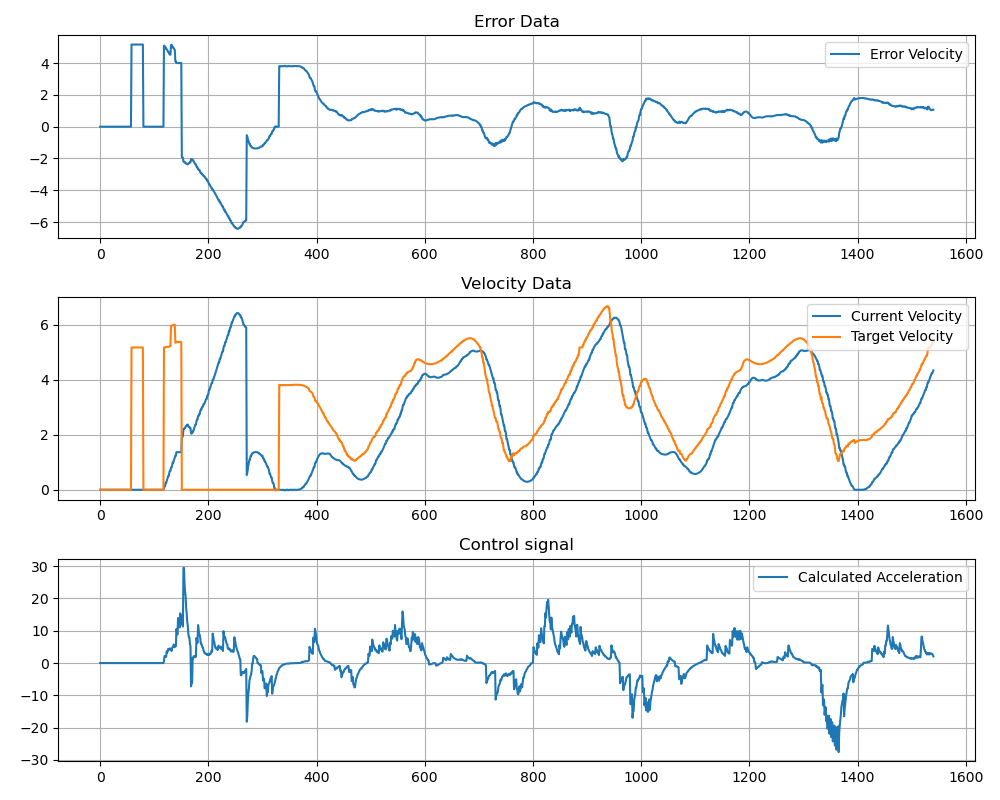
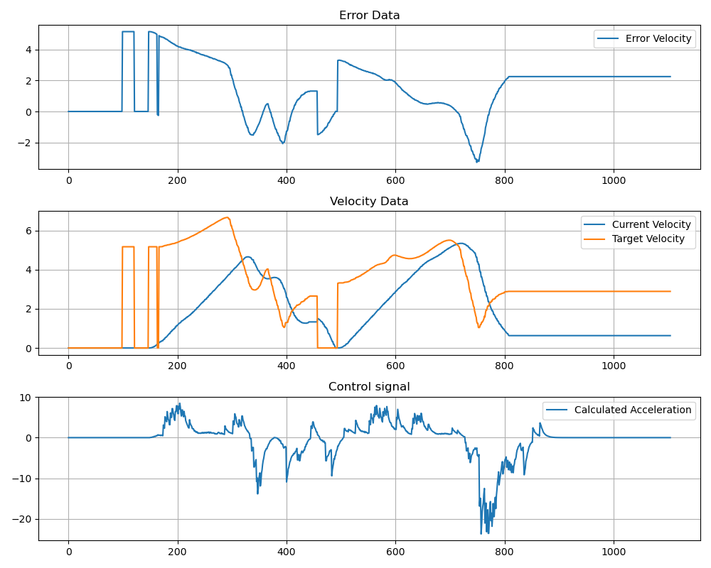

# Error-based ADRC logitudinal controller

Error-based ADRC (Active Disturbance Rejection Control) is a control method that estimates the extended state of an object. This state consists of the total disturbance and the state of the object. In the error-based concept, the state of the object is represented by the error and its derivatives up to the order of the object. 

Longitudianl controller takes velocity from waypoint as input and produces acceleration as output (control signal).

To create an ESO, the order of the object must be known. The results of the identification are as follows:

The plot shows the dynamics of an integrating system, so the order of the control object is 1 and the order of the ESO is 2 (order of the object + 1).

The controller consists of one main class and a second class that is responsible for the extended state observer (ESO). The ESO class has methods to initialize the observer, calculate the state of the ESO and provide helper functions. The main class, in addition to common functions for the longitudinal controller, has a function to calculate the control signal.

There are some plots that compare the performance of the eADRC and PID longitudinal controllers.

Error based controller ADRC:

PID controller:

