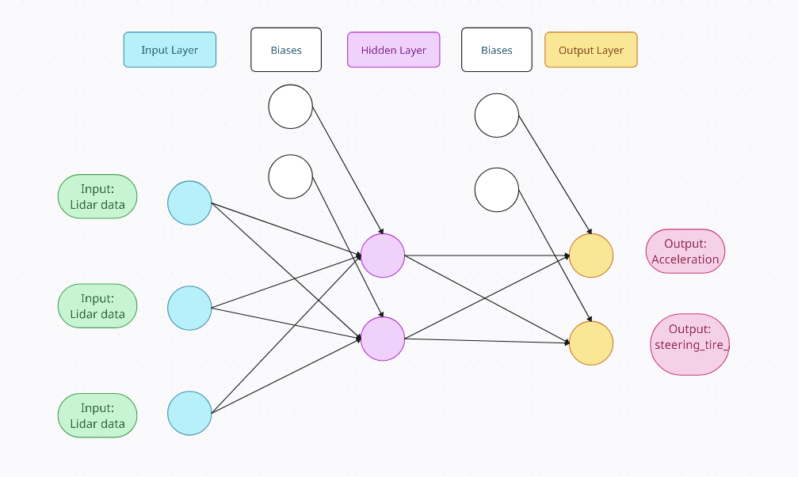

# Obstacle avoidance using a genetic algorithm
This is project for avoiding obstacles using genetic algorithm.

## Launching the demo
For installation refer to [Installation](../../../installation/index.md). Remember to change branch to `f1teenth`.

To run code properly following lines needs to be modified in launcher/f1tenth_launch/launch/components/f1tenth_control.launch.py :
```python
('output/control_cmd', '/control/command/control_cmd2'),
```
```python
('output/gear_cmd', '/control/command/gear_cmd2'),
```

Once modified you can launch autoware with

```bash
ros2 launch f1tenth_launch e2e_simulator.launch.py
```

Then launch AWSIM

```bash
./autoware_awsim/AWSIM_v1.2.0.x86_64
```

Next launch package grupa12 for processing lidar data:

```bash
ros2 launch grupa12 grupa12.launch.py 
```

And final package grupa12_nnetwork for running the genetic algorithm

```bash
ros2 launch grupa12_nnetwork grupa12_nnetwork.launch.py 
```

You should get effects like this:

<div align="center">
  <a href="https://www.youtube.com/watch?v=oUxi_z4eGHk">
    
  </a>
</div>

## Algorithm description

### Key Components
1. **Population**: In our case single car, which runs multiple times in one population with different weights. The number or cars is set to 25 by default (value can be changed in grupa12_nnetwork_node.cpp).

2. **Chromosome**: All weights in the network.

3. **Gene**: Single weight.

4. **Fitness Function**: distance covered by car.

5. **Selection**: The weights of the run with the longest distance covered.

6. **Crossover (Recombination)**: A genetic operator that combines two parent chromosomes to produce offspring.

7. **Mutation**: A genetic operator that introduces random changes to individual genes in a chromosome to maintain genetic diversity.

### Process Overview
1. **Initialization**: Start with a randomly generated population of chromosomes.
2. **Evaluation**: Assess the fitness of each chromosome using the fitness function.
3. **Selection**: Select pairs of chromosomes to be parents, based on their fitness scores. Common methods include roulette wheel selection, tournament selection, and rank-based selection.
4. **Crossover**: Create offspring by combining the genes of two parents. Methods include single-point crossover, two-point crossover, and uniform crossover.
5. **Mutation**: Introduce random changes to some genes in the offspring chromosomes to maintain diversity and avoid premature convergence.
6. **Replacement**: Form a new population by replacing some or all of the old population with the new offspring.
7. **Termination**: Repeat the evaluation, selection, crossover, and mutation steps until a stopping criterion is met, such as a maximum number of generations, a satisfactory fitness level, or a lack of significant improvement over generations.

### Proposed neural network architecture
<p align="center">
  
</p>

## Future development
* changing network architecture
* different processing of lidar data
* trying other activiation functions
* improving training process
* tuning hyperparameters (mutation rate, population size, mutation size)

