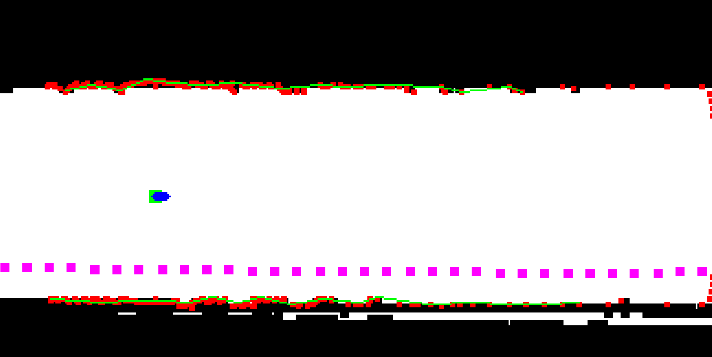
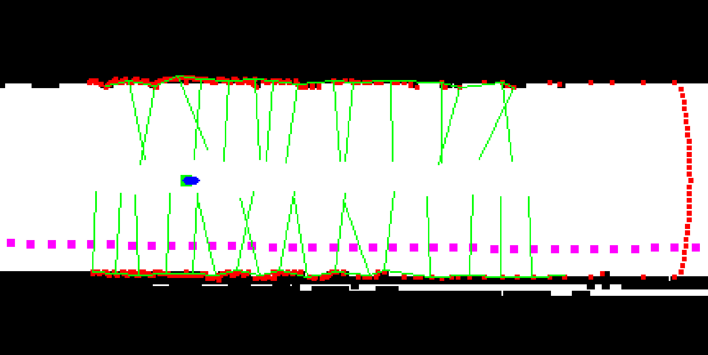
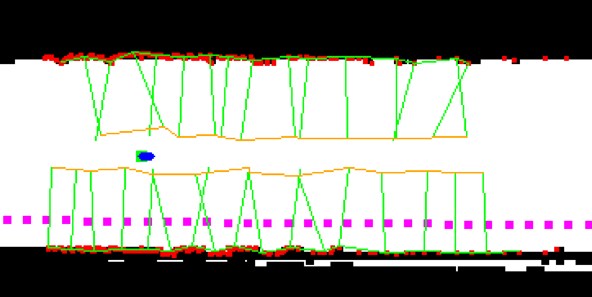
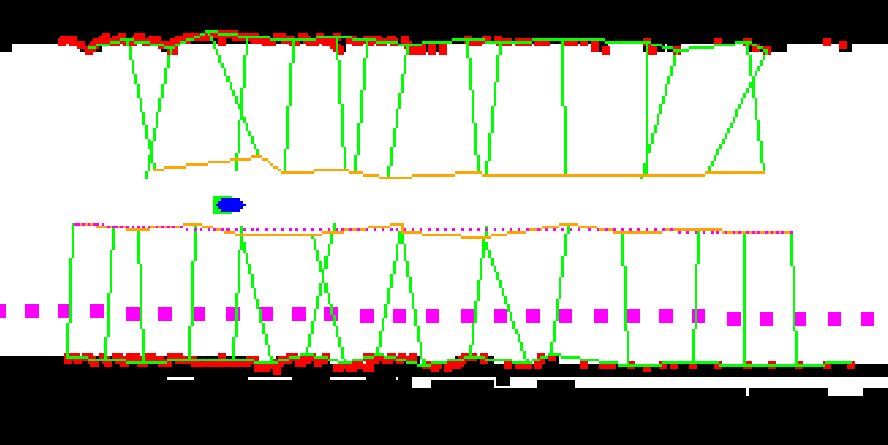
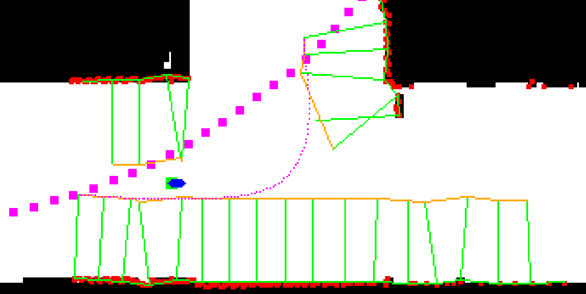
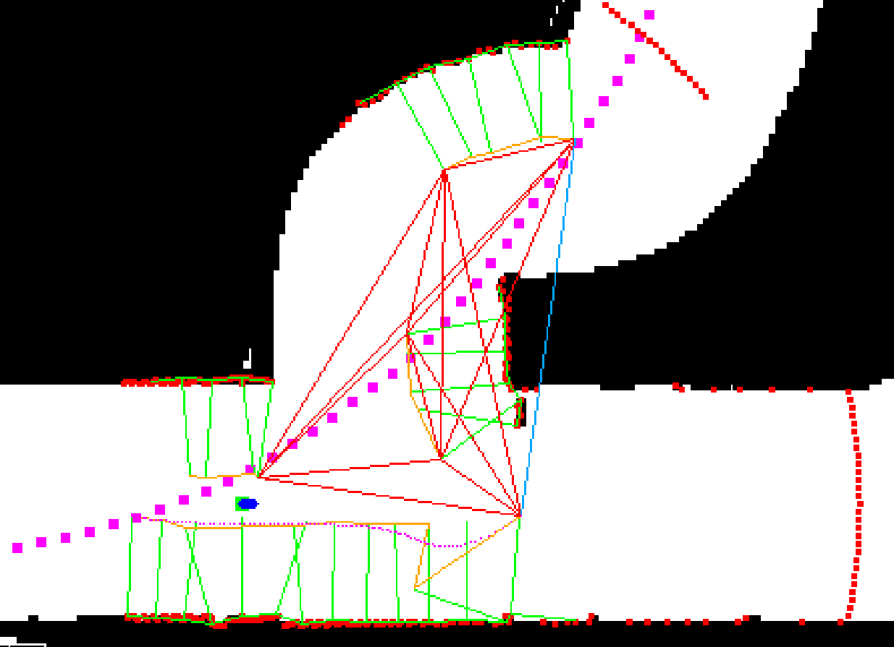
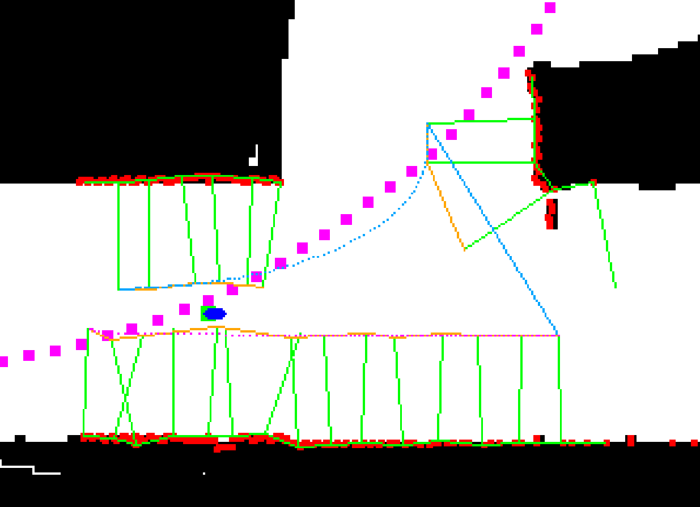
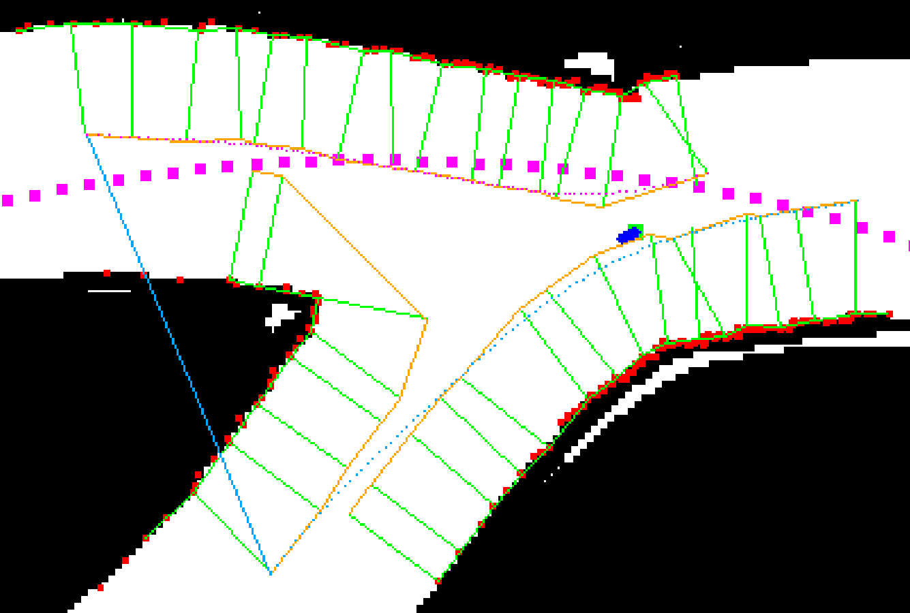

# Lidar Trajectory Planner

This is project page for planning trajectory for the f1teenth bolid locally with lidar data only.

## Running the demo

For installation refer to [Installation](../../../installation/index.md). Remember to change branch to `f1teenth`.

Once installed you can launch autoware with

```bash
ros2 launch f1tenth_launch e2e_simulator.launch.py
```

Then launch AWSIM

```bash
./autoware_awsim/AWSIM_v1.2.0.x86_64
```

If you don't have a pad to change the gear to DRIVE use this command and wait some time until gear changes to DRIVE permamently

```bash
ros2 topic pub /control/command/gear_cmd autoware_auto_vehicle_msgs/msg/GearCommand {"command: 2"}
```

Finally you can press the `AUTO` button in the rviz and observe how the bolid starts driving.

You should get effects like this:

<video src="videos/lidar_trajectory_awsim.mp4" type="video/mp4" width="1000" controls>
    Your browser does not support the video tag.
</video>

Below you can observe how the path is being planned.

<video src="videos/lidar_trajectory_rviz.mp4" type="video/mp4" width="1000" controls>
    Your browser does not support the video tag.
</video>

## lidar_trajectory package API
<!-- Required -->
<!-- Things to consider:
    - How do you use the package / API? -->

The package can be found in src folder.

<p align="center">
  
</p>

### Input

| Name         | Type                  | Description  |
| ------------ | --------------------- | ------------ |
| `/sensing/lidar/scan` | sensor_msgs::msg::LaserScan | Data from lidar |
| `/localization/kinematic_state` | nav_msgs::msg::Odometry | Odometry |

### Output

| Name         | Type                  | Description  |
| ------------ | --------------------- | ------------ |
| `/planning/racing_planner/trajectory` | autoware_auto_planning_msgs::msg::trajectory | Planned trajectory |


## Algorithm

If you want to use a simplified environment to run your ideas and test how this algorithm works, you can find the Python implementation at this [link](https://github.com/MikolajZielinski/Lidar-Trajectory-Planner).

Below images are depicting bolid (green square with blue arrow), lidar points (red points), reference trajectory (pink points).

The first step is to connect all the lidar points together. If the distance between consecutive points is larger then the threshold, divide the line into sections. Then reduce number of points in each section.



Find normal vectors to the points.



Connect the ends of normal vecotrs together.



Use bezier curve to smooth obtained path.



Add the ability to properly join two path sections. This is done by finding two closest points on both paths and connecting them together. At the same time rest of the points is ignored.



Next step is to recognize the intersections. To achieve that, every start and end point from each subsection is connected with each other. Then the triangle with biggest perimeter is found.



Left corner of this triangle is showing the path to the left, and right corner to the right. Here we can see two examples of trajectories planned on intersections.




## Future work

There are several features that can be added to this system:
- Improving the stability of the planned path.
- Ability to dynamically select right or left turns.
- Calculating the speed of the bolid based on the trajectory curve. This would lead to the bolid going faster on a straight road and slowing down on curves.