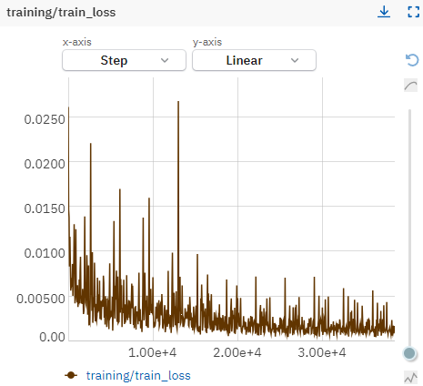
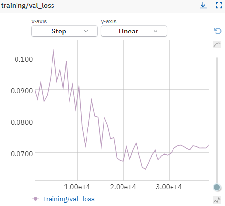
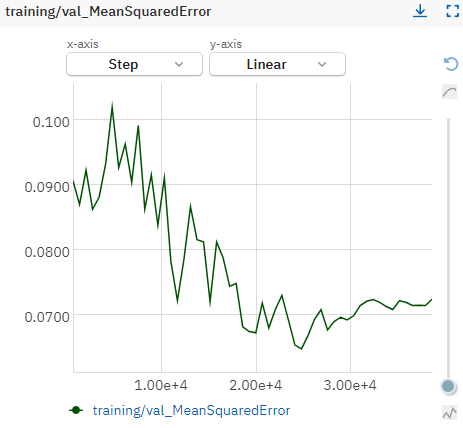
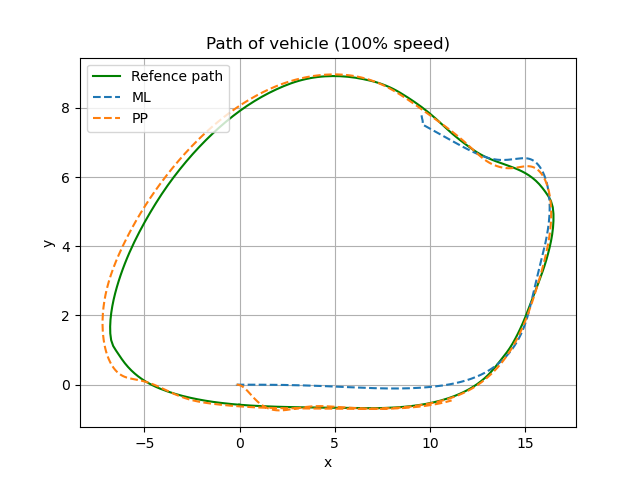

# ML Controller

Project has 3 main repositories:

- [ml-controller](https://github.com/Gandhi444/ml_controller)
- [nc-net](https://github.com/SzymKwiatkowski/nc-net)
- [f1tenth_awsim_data_recorder](https://github.com/SzymKwiatkowski/f1tenth_awsim_data_recorder)

## Controller (ml-controller)

Package for ros2 using [TensorRT](https://developer.nvidia.com/tensorrt) engine.

## Training model (nc-net)

Repository [nc-net](https://github.com/SzymKwiatkowski/nc-net) contains:

- training
- exporting model to onnx format

Training module is using a couple of different selected models:

- Basic neural network - with fully connected layers
- RBF network - with RBF model variation for model calculation
- DenseRBF - fully connected backbone extraction with RBF added on top
- skip connection model - model with skip connection

As well as losses:

- MSE Loss
- Huber Loss
- L1 Loss

All of the training can be logged by using two different loggers specified in configuration:

- Tensorflow board (used by default)
- Neptune ai

During training dataset provides data based on specified count of points which are extracted from trajectory. Then during training all of the data is extracted and provided in batches based on car current position from sample taken from dataset.
It also normalizes outputs to `(0, 1)` values based on vehicle maximum steer parameter provided from ros2 node.

To train model recorded data via using f1tenth_awsim_data_recorder is required (there is an option of using some small recorded data in data directory).
Dataset can be adjusted with `datasets.json` file in data directory. Example configuration is present in repository and looks as follows:

```json
[
  {
    "main_df": "main_df.csv",
    "points_df": "points_df.csv",
    "points_count": 271,
    "train_size": 0.75
  }
]
```

This way multiple datasets can be provided to ensure more data during training is delivered from many different trajectories.

Parameters are:

- main_df: string - path to specified dataframe containing recorded data poses of car as well as control inputs

- points_df: string - path to specified dataframe containing recorded trajectory for

- points_count: int - count of points for specified input trajectory provided in `points_df` param

- train_size: float - size for training dataset `(0, 1)` value.


### Graphs of training progress:







## Recording data (f1tenth_awsim_data_recorder)

To use package clone it to src directory of ros2 workspace and then build it. To launch use command:

```bash
ros2 launch f1tenth_awsim_data_recorder f1tenth_awsim_data_recorder.launch.py
```

Package has parameters that can be adjusted in parameters file.

### Parameters

Used via `f1tenth_awsim_data_recorder.param.yaml` file in config directory.

| Name               | Type   | Description                                                                                            |
| ------------------ | ------ | ------------------------------------------------------------------------------------------------------ |
| max_points_count   | int    | Maximum count of points saved (remaining if path is shorter then specified amount it is filled with 0) |
| ackermann_topic    | string | Sample desc.                                                                                           |
| ground_truth_topic | string | Sample desc.                                                                                           |
| trajectory_topic   | string | Sample desc.                                                                                           |

Example configuration can look as follows:

```yaml
/**:
  ros__parameters:
    max_points_count: 271 # Max points count being saved from trajectory topic
    ackermann_topic: "/control/command/control_cmd"
    ground_truth_topic: "/localization/cartographer/pose"
    trajectory_topic:  "/planning/racing_planner/trajectory"
```

## Results



[](https://www.youtube.com/watch?v=in6zMdxMCaY)