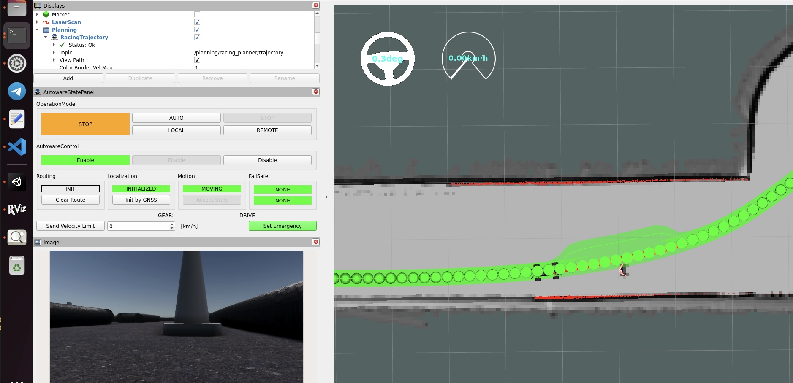
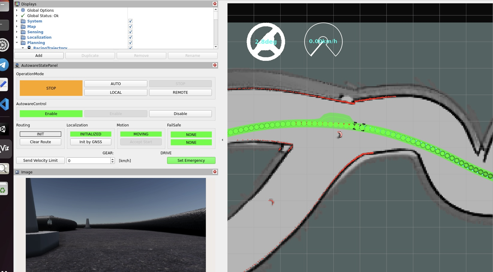

# Obstacle Avoidance Node

## Overview
This repository contains the implementation of an Obstacle Avoidance Node for autonomous vehicles. It is designed to integrate seamlessly with Autoware and ROS 2 environments, providing real-time obstacle detection and avoidance capabilities.

## Features
- Real-time obstacle detection using LIDAR data.
- Dynamic path planning to avoid detected obstacles.
- Integration with ROS 2 and Autoware

## Prerequisites
Before you begin, ensure you have met the following requirements:
- ROS 2 (Humble recommended)
- Autoware
- C++ Compiler (GCC or Clang)

## Installation
Follow these steps to install the Obstacle Avoidance Node:

1. **Clone the repository:**
   ```bash
   git clone https://github.com/zelmanowskamaja/obstacle_avoidance_node.git

2. **Build**
    ```bash
   cd your_ros2_worspace
   colcon build --packages-select obstacle_avoidance_node
   source install/setup.bash

## Obstacle detection

### Overview
`obstacle_detection` is a script designed for real-time obstacle detection within a ROS 2 framework. It leverages sensor data to detect objects and potential hazards in the operational environment of a robot or autonomous vehicle.

### Key Functionalities
- **Sensor Data Acquisition**: The script subscribes to LIDAR data from a topic typically named `/sensing/lidar/scan`, which provides real-time information about the surroundings.

- **Obstacle Detection**: Utilizes algorithms to analyze LIDAR data and identify obstacles based on predefined criteria such as object size, distance, and relative velocity.

- **Publishing Detection Results**: 
  - Publishes detailed information about detected obstacles to a topic called `/obstacle_detected`, which includes data such as location, size, and type of the detected objects.
  - Additionally, it publishes filtered sensor data to `/filtered_lidar_scan`, which contains modifications to the original LIDAR scans that highlight or omit detected obstacles.

- **Visualization**: Sends data to `/visualization_marker`, allowing visualization of detected obstacles in visualization tools such as RViz. This helps in debugging and system evaluation by providing a visual representation of the sensor data and detected objects.

### Integration Points
- Seamlessly integrates with other ROS 2 nodes by using standard message types and custom services, ensuring compatibility and extendibility in complex robotics architectures.


## Obstacle avoidance

### Overview
`obstacle_avoidance.cpp` is a C++ executable meant for navigating environments by actively avoiding obstacles. It is part of an autonomous navigation system, utilizing data from various sensors and detection systems to calculate safe and efficient paths.

### Key Functionalities
- **Receiving Obstacle Data**: Subscribes to a topic `/obstacle_data`, where it expects to receive information about detected obstacles, including their positions and dimensions.

- **Path Planning and Adjustment**: 
  - Continuously calculates and recalculates paths to ensure collision-free navigation. 
  - Uses data from the `/obstacle_data` topic to adjust the planned paths in real-time, avoiding detected obstacles.

- **Publishing Updated Paths**: 
  - Outputs the new, adjusted trajectory to a topic named `/planning/racing_plaster/avoidance/trajectory`, which is then used by the vehicle control systems to steer the vehicle along the safe path.

- **Safety Mechanisms**: Implements various safety checks and balances to ensure that the avoidance maneuvers do not compromise the operational safety guidelines.

### Integration Points
- Integrates tightly with both the sensory and control modules of an autonomous system, providing a critical link between raw data interpretation and actionable navigation commands.


## Images 



### Overview
This screenshot displays a visualization in RViz of an obstacle avoidance simulation for an autonomous vehicle using Autoware and ROS 2.

### Key Elements

- **Racing Trajectory**: The bright green line with semi-transparent green shading shows the planned trajectory of the vehicle. This trajectory dynamically adjusts based on real-time data to avoid potential obstacles and ensure safe navigation.

- **Potential Fields Intensity**: The green circles displayed along the trajectory represent the intensity of the potential fields. The color and size of these circles indicate the strength of the forces acting on the vehicle to steer it away from obstacles, with larger and brighter circles indicating stronger forces.

- **Laser Scan Data**: The red points across the bottom of the visualization represent laser scan data, detecting physical objects and barriers around the vehicle. This data is critical for both obstacle detection and avoidance computations.

- **Filtered Laser Scan**: The white dots seen within the red laser scan data represent filtered points from the laser scan that are identified as obstacles. These filtered points are used to enhance the accuracy of the obstacle detection process by focusing on significant obstructions and ignoring irrelevant data.


### Real-Time Operation Video

Below is a link to a video demonstrating the real-time operation of the autonomous vehicle as it navigates and avoids obstacles using the obstacle avoidance system implemented in this project.

[Obstacle Avoidance Video](https://drive.google.com/file/d/1fYf1Lq7TgqLk40sqNNdQ3WZBd1M5kvBf/view?usp=sharing)

This video provides a clear visual representation of how the system perceives its environment and makes dynamic decisions to ensure safe navigation around obstacles. It's an excellent resource for understanding the practical application and effectiveness of the obstacle avoidance algorithms developed.
