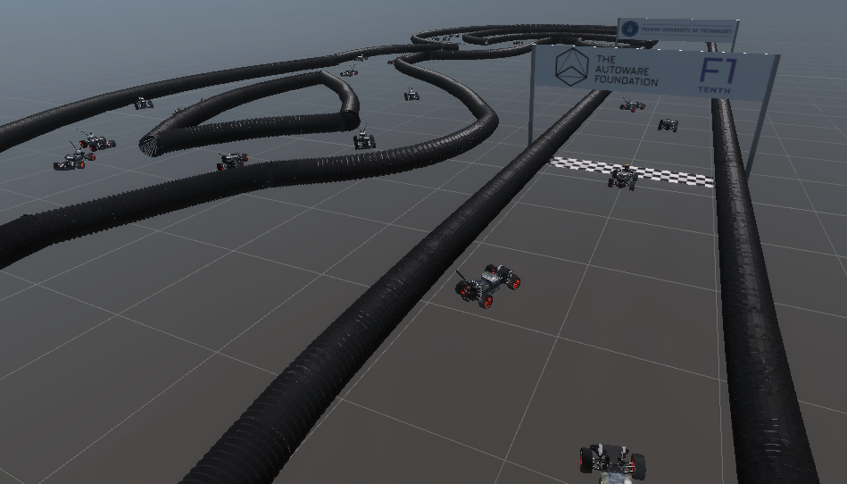
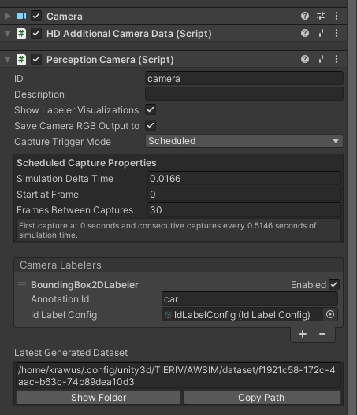
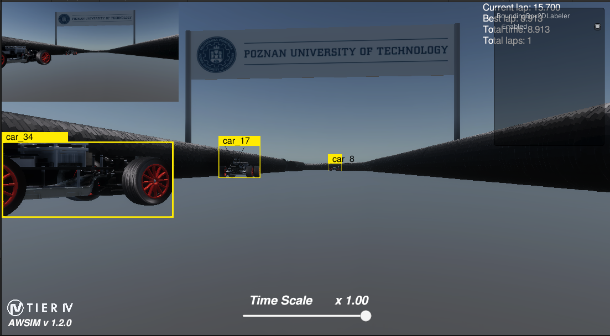

# Yolo racecar detector
This is the ROS2 package used to detect f1tenth cars on the image captured from the camera. The inference is done using the [TensorRT](https://developer.nvidia.com/tensorrt) engine based on the [yolov8](https://github.com/ultralytics/ultralytics) architecture model. The method of performing the inference was inspired by [zed-custom-detector](https://github.com/stereolabs/zed-sdk/tree/master/object%20detection/custom%20detector/cpp/tensorrt_yolov5-v6-v8_onnx) and adapted for use with ROS2 and OpenCV.

## 1. Package usage guide

### Installation

```bash
rosdep install --from-paths src --ignore-src -y
colcon build --symlink-install --cmake-args -DCMAKE_BUILD_TYPE=Release -DCMAKE_EXPORT_COMPILE_COMMANDS=On --packages-up-to yolo_racecar_detector
```

### Launching

```bash
ros2 launch yolo_racecar_detector yolo_racecar_detector.launch.py
```

### API


#### Input

| Name       | Type                | Description     |
| ---------- | ------------------- | --------------- |
| `in/image` | `sensor_msgs/Image` | The input image |

#### Output

| Name          | Type                                               | Description                                        |
| ------------- | -------------------------------------------------- | -------------------------------------------------- |
| `out/objects` | `tier4_perception_msgs/DetectedObjectsWithFeature` | The detected objects with 2D bounding boxes        |
| `out/image`   | `sensor_msgs/Image`                                | The image with 2D bounding boxes for visualization |


#### Parameters

| Name         | Type | Description  |
| ------------ | ---- | ------------ |
| `onnx_model_path` | string  | relative path to yolo model in onnx     format |
| `trt_engine_path` | string | relative path to trt engine (will be generated if does not exist)|
|`confidendce_threshold` | float | If car detection confidence score is less than this value, the object is ignored.|
|`nms_threshold` | float | The IoU threshold for Non-maximum Suppression|


### Demo
<iframe width="1705" height="968" src="https://www.youtube.com/embed/NwCGJqMBUoY" title="yolo racecar detector inference demo" frameborder="0" allow="accelerometer; autoplay; clipboard-write; encrypted-media; gyroscope; picture-in-picture; web-share" referrerpolicy="strict-origin-when-cross-origin" allowfullscreen></iframe>

## 2. Using custom YOLOv8 model

### 2.1 Collecting dataset
To train the YOLOv8 network for the F1Tenth car detection task, it was necessary to generate a synthetic dataset using the Unity environment and the Perception Package version 0.10, which is compatible with the project version.
#### Map
In the first step, 36 F1Tenth cars were placed on the provided map containing the racetrack.
In order to avoid potential overfitting of the network to a given background, modifications were made to the sky texture and track surface during data collection.


#### Labeling
The Labelling module from the Perception package was used for data labeling. Each car model was assigned the label "car" through the creation of a Label Configuration.


Next, a Perception Camera script was assigned to the front-facing camera of our vehicle, allowing it to capture frames at specified intervals during the simulation (one in 30 frames was saved). With the appropriate script configuration and linking to the previously created Label Configuration, each image is saved and properly labeled in a corresponding JSON file.


### Collecting Data
During the simulation run, we obtain a visualization of the bounding boxes for each car placed on the map. These bounding boxes are saved in the following format:
```json
{
  "filename": "path/to/image.png",
  "format": "PNG",
  "annotations": [
    {
      "id": "car",
      "annotation_definition": "car",
      "values": [
        {
          "label_id": 1,
          "label_name": "car",
          "instance_id": 1,
          "x": x-coordinate,
          "y": y-coordinate,
          "width": width-value,
          "height": height-value
        },
        {
          "label_id": 1,
          "label_name": "car",
          "instance_id": 2,
          "x": x-coordinate,
          "y": y-coordinate,
          "width": width-value,
          "height": height-value
        }
        // Additional bounding boxes
      ]
    }
  ]
}
```
rom 2024-06-10 20-13-55](images/yolo_racecar_detector_bbox.png)

### 2.2 Prepare Data
The script `prepare_data.py` converts a dataset created in Unity to the COCO or YOLO format, which is used for training. Run the script with the following command:
```sh
python prepare_data.py path/to/config.json
```
- `path/to/config.json`: Path to the config file generated by Unity.
- `--convert_to_yolo`: Add this flag if you want to convert the COCO dataset to YOLO format.
- `--output_dir`: Specify the output directory where the converted files will be saved. Default is 'dataset'.
- `--split_data`: Add this flag if you want to split your dataset into training, validation, and test sets.
### 2.3 Training with Generated Data
Once you have converted your dataset to  YOLO format, you can use the generated data for training models using the Ultralytics  framework. Follow the instructions in the [Ultralytics repository](https://github.com/ultralytics/ultralytics) to set up and train your models.


<div style="display: flex; width: 100%; gap: 10px; margin: 10px;">
  <figure style="display: flex; flex: 1; flex-direction: column; align-items: center; width: 50%; margin: 0px;">
    
    <figcaption><b>Label</b></figcaption>
  </figure>
  <figure style="display: flex; flex: 1; flex-direction: column; align-items: center; width: 50%; margin: 0px;">
          
    <figcaption><b>Predict</b></figcaption>
  </figure>
</div>
