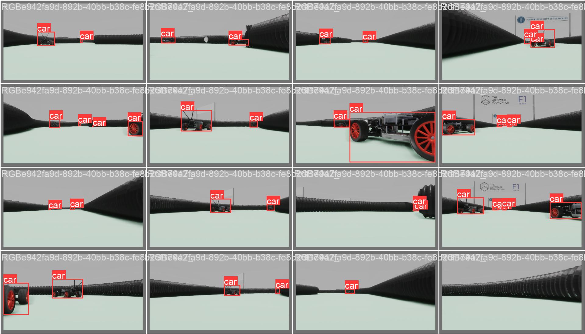
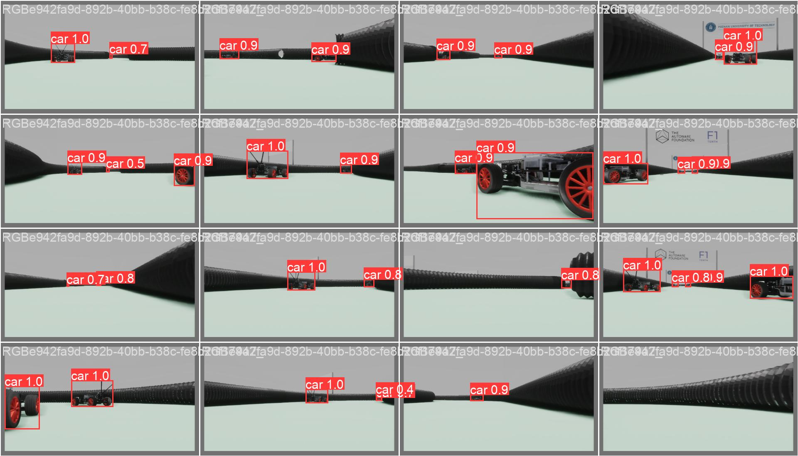

## Overview
The script `prepare_data.py` converts a dataset created in Unity to the COCO or YOLO format, which is used for training.

## 1. Prepare Data
Run the script with the following command:
```sh
python prepare_data.py path/to/config.json
```
- `path/to/config.json`: Path to the config file generated by Unity.
- `--convert_to_yolo`: Add this flag if you want to convert the COCO dataset to YOLO format.
- `--output_dir`: Specify the output directory where the converted files will be saved. Default is 'dataset'.
- `--split_data`: Add this flag if you want to split your dataset into training, validation, and test sets.
## 2. Training with Generated Data
Once you have converted your dataset to  YOLO format, you can use the generated data for training models using the Ultralytics  framework. Follow the instructions in the [Ultralytics repository](https://github.com/ultralytics/ultralytics) to set up and train your models.

<div style="text-align: center;">
  <figure style="display: inline-block; margin: 10px;">
    
    <figcaption>Labels</figcaption>
  </figure>
  <figure style="display: inline-block; margin: 10px;">
    
    <figcaption>Predict</figcaption>
  </figure>
</div>


