# F1TENTH

## Overview

This tutorial will guide you through the process of setting up a development environment for the F1TENTH simulation and testing capabilities of Autoware. 

The demo will be run in the AWSIM simulator, which is a simulator for Autoware development and testing. For more information, please visit the official [website](https://tier4.github.io/AWSIM/) provided by TIER IV. The nature of 1/10 racing differs from real-world autonomous driving, so the simulator has been adapted and it is still under development to better fulfill the needs of the F1TENTH. Following that, the [Autoware architecture](../../design/autoware-architecture/node-diagram/index.md#autoware-universe) has been adjusted accordingly due to platform differences and the primary objective of autonomous aspects within the racing use case.

[Open in draw.io for fullscreen]({{ "/tutorials/f1tenth/overall-node-diagram-autoware-f1tenth.drawio.svg" | drawio }})

Note that the diagram is for reference. We are planning to update this diagram every release and may have old information between the releases.
If you wish to check the latest node diagram use rqt_graph after launching the Autoware.

Check [installation](installation.md) and [full demo](full-demo.md).